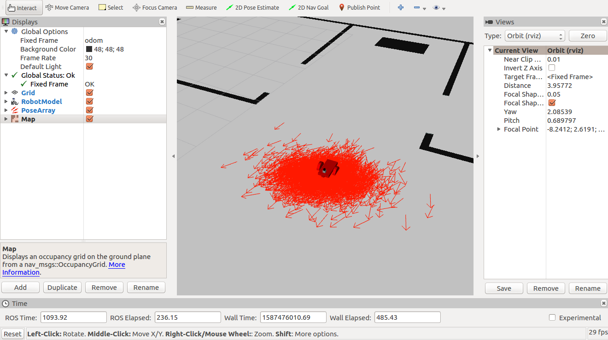

# Localization_using_AMCL
Using ROS AMCL package to accurately localize a mobile robot inside a map in the Gazebo simluation environment

## Project Aim:
1. Create a ROS package that launches a custom robot model in a custom Gazebo world
2. Utilize the ROS AMCL package and the Tele-Operation / Navigation Stack to localize the robot
3. Explore, add, and tune specific parameters corresponding to each package to achieve the best possible localization results

## Installation:
```
$ sudo apt-get install ros-kinetic-navigation
$ sudo apt-get install ros-kinetic-map-server
$ sudo apt-get install ros-kinetic-move-base
$ sudo apt-get install ros-kinetic-amcl
```

## Steps to Launch:
### step 1 create the catkin_ws
```
$ mkdir -p /home/workspace/catkin_ws/src
$ cd /home/workspace/catkin_ws/src
$ catkin_init_workspace
$ cd ..
$ catkin_make
```

### Step 2 Perform a System Update/Upgrade
```
$ apt-get update
$ apt-get upgrade -y
```
### Step 3 Clone the Package in src
```
$ cd /home/workspace/catkin_ws/src
$ git clone https://github.com/mahendraseervi/Localization_using_AMCL.git
```
### Step 4 Build the Packages
```
$ catkin_make
$ source devel/setup.bash
```
### Step 5 Launch the gazebo world with robot model
```
$ roslaunch my_robot world.launch 
```
### Step 6 Launch the amcl_localization launch files
```
$ roslaunch amcl_localization amcl.launch
```
### Step 7 Launch the rviz and save the required configuration
```
$ rosrun rviz rviz -d amclocalization_rviz.rviz 
```
### Step 7 use the teleop_twist_keyboard to move the robot and localize it
```
$ rosrun teleop_twist_keyboard teleop_twist_keyboard.py 
```
Now, you should see Gazebo and rviz launching with robot localized in the map

## Images :
### Map created using pgm_map_creator ros package:


### Robot in the gazebo simulation world:


### robot localized in rviz (zoomed in):


### robot localized in rviz (zoomed ou):


